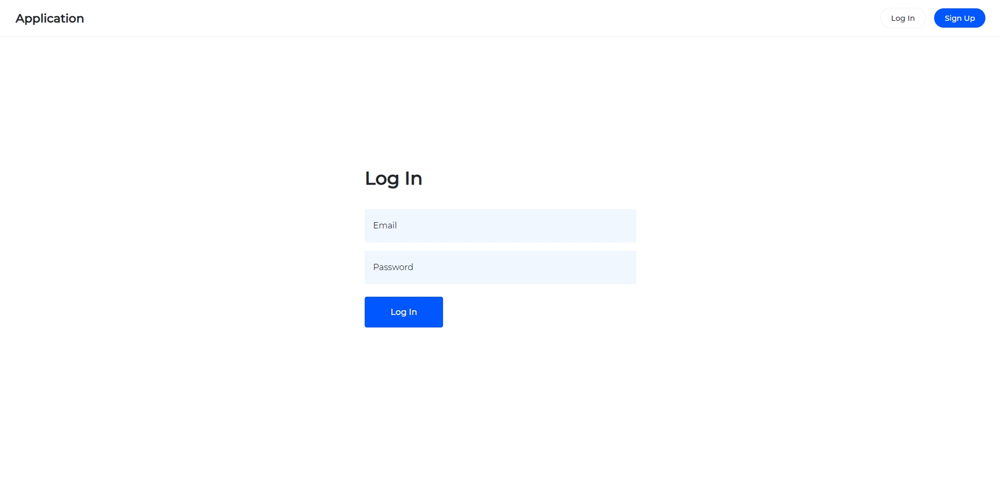

# Token Authentication Service

A token-based authentication service.

## Description

A token-based authentication service consumed by a React application.

## Motivation

I built this service to learn more about authentication and security. Please note that I am aware of better alternatives than JWTs and have since built a [new an improved service](https://github.com/louis-young/session-authentication-service).

## Technologies

- JavaScript.
- React.
- Node.
- Express.
- MongoDB.
- JWT.

---

This project was bootstrapped with [Create React App](https://github.com/facebook/create-react-app).

### Available Scripts

In the project directory, you can run:

#### `npm start`

Starts the authentication service.
